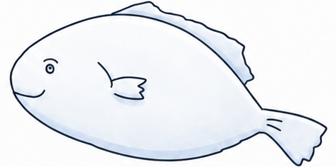

# 자린고비 가계부 (Jaringochi)

> **한 달은 너무 길다. 그래서 "주(週) 단위"로 쪼갠 절약 코칭 가계부.**
> 절약의 상징 **굴비**가 마스코트이자 코칭 캐릭터.

<p align="center">
  
</p>

---

## 🐟 무엇을 푸는 앱인가

한 달 예산을 잡아도 30일은 너무 길어서, "지금 이 속도로 써도 되나?"가 막연합니다.
자린고비는 **사용자가 직접 정한 주(週) 예산**을 기준으로, 그 주에 맞춰 소비하도록 돕습니다.

핵심은 **굴비의 실시간 코칭**입니다.
주간 예산과 **이번 주에 며칠이 지났는지(요일)** 를 함께 따져서,
"지금 페이스 대비 얼마나 썼는지"에 따라 굴비의 **표정과 멘트가 달라지며** 격려하거나 경고합니다.

여기에 두 가지 동기 부여 장치를 더합니다.

- **월간 AI 레포트** — 매월 초, 지난달을 정산한 상세 금융 코칭 리포트를 발간.
- **굴비 옷 뽑기 보상** — 한 주 예산을 지켜내면 옷 뽑기 기회를 주고, 뽑은 옷을 굴비에게 입힐 수 있음.
  (재미 요소 + 사용자 보상 + 절약 유인책)

---

## ✨ 핵심 기능

### 1. 주간 예산 + 굴비 실시간 코칭 (홈)
- 사용자가 **주 예산**을 설정 → 이번 주 사용률을 게이지로 직관 표시.
- **페이스 기반 표정**: 하루치 예산 = 주예산 ÷ 7. 요일 D(월=1…일=7)까지 `D/7` 사용은 정상(`happy`),
  1/7씩 초과할 때마다 `smirk → angry → sad` 로 표정·멘트가 단계 변화.
  (단순 "예산 초과"가 아니라 **"지금 속도가 빠른가"** 를 본다)
- 월 수입/지출 요약, 최근 거래도 한눈에.

### 2. 가계부 (거래 기록)
- **일자별 / 달력** 두 보기 (마지막 본 탭 유지).
- 거래 등록·수정·삭제(수입/지출), 메모/카테고리 **검색** + 정렬(날짜·금액).
- 달력에서 날짜를 누르면 그날 수입/지출/합계 + 거래 목록 모달.

### 3. 통계
- `월·주 × 수입·지출 × 단순금액·카테고리별` 조합.
- 월별 지출 추이(꺾은선·전월대비), 카테고리 도넛(상위 4 + 기타), 주간 예산 vs 지출 막대 — **전부 인라인 SVG**.

### 4. 알림 (종 배지) — 3종
기본 발생 시점은 이렇게 정의됩니다.
- **예산 사용 알림** — 주간 예산 사용이 **임계치(25·50·75·100·125·150%)를 넘을 때** 그 단계 알림.
- **옷 뽑기 기회 알림** — **한 주가 끝나고 새 주가 시작될 때**, 지난 한 주 예산을 지켰으면(절약 성공) 옷 뽑기 기회 안내.
- **월 레포트 알림** — **새 달(월 초)이 시작되면** 지난달 레포트가 준비됐다고 안내.

> 구현 메모: 옷 뽑기·레포트 알림은 **스케줄러 없이** 알림 조회 시점에 자격을 검사해 생성 → 화면만 이동해도 배지가 자동 갱신됩니다.
> (현재 "지난주 / 최근 4주 / 지난달"을 한 번에 검토하는 동작은, 테스트 데이터(`alice`)가 과거 기록을 미리 채워 둬서 그 누적분을 한꺼번에 보정하는 특수 케이스입니다. 실사용에선 위 세 시점마다 자연히 1건씩 발생합니다.)

### 5. 월간 AI 레포트
- 매월 초, **지난달**을 정산해 1회 생성·캐싱.
- 총지출/전월대비, 카테고리 분석(전월·당월 비교 도넛), 다음 달 조언, **굴비의 총평**(이야기형).
- 굴비 표정(mood)은 그 달 예산 달성 주 수로 **코드가 결정**하고, AI는 그 톤으로 텍스트만 생성.
- **굴비에게 한 마디**: 월 1회 대화 — 내가 한 마디 건네면 굴비가 답해줌.

### 6. 굴비 옷 뽑기 (절약 보상)
- 끝난 주에 **지출 ≤ 예산**(절약 성공)이면 옷 뽑기 자격.
- **AI(Gemini)가 매번 새 옷을 디자인** + 한국어 옷 이름 생성. 굴비의 4가지 무드가 같은 옷을 착용(앵커→레퍼런스로 일관성 유지).
- 결과를 **받기/거절** 선택 → 받으면 홈 굴비의 외형이 그 옷으로 갱신.

### 7. 계정 / 인증
- 회원가입·로그인·로그아웃, 프로필 수정, 회원 탈퇴(soft delete).
- **JWT** Access Token(1시간) + Refresh Token(14일, DB에 해시 저장·로그아웃 시 폐기).

---

## 🛠 기술 스택

### 백엔드 (`jaringochi/`)
- **Java 21 · Spring Boot 4.0.6**
- **MyBatis** (매퍼 XML) · **MySQL** (스키마 `jaringochi`)
- **Spring Security + JWT** (OAuth2 Resource Server 방식)
- **springdoc-openapi** (Swagger UI)
- **Spring AI** (OpenAI `gpt-5.4-mini`) — 레포트·굴비 한마디 텍스트 생성
- **Google Gemini** (`gemini-3.1-flash-image`) 직접 호출 — 굴비 옷 이미지 생성
- 도메인형 패키지: `domain/<도메인>/{controller, service, dao, dto}`
  (`auth/user` · `category` · `transaction` · `budget` · `statistics` · `notification` · `report` · `gulbi`)

### 프론트엔드 (`jaringochi-front/`)
- **Vue 3.5** (`<script setup>` SFC) · **Vite** · **Vue Router** · **Pinia** · **axios**
- **그림판(paint) 손그림 단일 테마** — 손글씨 폰트 + 흔들리는(wobble) 손그림 테두리, 굴비 PNG 마스코트(표정 4종 + 인사).
- 차트는 전부 **인라인 SVG** (외부 차트 라이브러리 없음).

---

## 🗂 저장소 구조

```
bp/
├─ jaringochi/          # 백엔드 (Spring Boot)
│  └─ src/main/java/com/bp/jaringochi/domain/
│       ├─ user · category · transaction · budget
│       ├─ statistics · notification · report · gulbi
│  └─ src/main/resources/  # schema.sql · data.sql · mappers/**
├─ jaringochi-front/    # 프론트엔드 (Vue 3 + Vite)
│  └─ src/  views · components · api · stores · composables · assets/gulbi
├─ mockups/             # HTML 화면 시안 + 디자인 시스템
├─ docs/                # API.md · PROGRESS.md · DECISIONS.md
├─ AGENTS.md            # 공유 컨텍스트(단일 진실 문서)
└─ README.md
```

### 도메인 (DB 7개 테이블)
`user` · `category` · `transaction` · `weekly_budget` · `notification` · `monthly_report` · `refresh_token`
→ 컬럼·관계·엔드포인트 상세는 **[docs/API.md](docs/API.md)** 가 단일 기준.

### REST 엔드포인트 요약 (Base URL `/api`, 인증 `Bearer`)
| 도메인 | 메서드 & 경로 |
|--------|---------------|
| 인증 | `POST /auth/signup` · `/auth/login` · `/auth/logout` · `GET /auth/check-nickname` |
| 사용자 | `GET·PUT·DELETE /users/me` |
| 카테고리 | `GET·POST /categories` · `PUT·DELETE /categories/{id}` |
| 거래 | `GET·POST /transactions` · `GET·PUT·DELETE /transactions/{id}` |
| 주간예산 | `GET /budgets/weekly/current` · `/weekly/recent` · `POST /budgets/weekly` · `PUT /budgets/weekly/{id}` |
| 알림 | `GET /notifications` · `/unread-count` · `PATCH /notifications/{id}/read` · `/read-all` |
| 통계 | `GET /statistics/by-category` · `/monthly-trend` |
| 레포트 | `GET /reports/monthly` · `POST /reports/monthly/talk` |
| 굴비 보상 | `GET /budgets/weekly/{id}/gulbi-reward` · `POST .../draw` · `POST .../decision` |

---

## 🎨 디자인 토큰 (그림판 테마 기준)

현재는 **그림판(paint) 손그림 테마 단일 운영**입니다 (초기 classic 골드/크림 테마는 제거).
흑백 손그림 기조에, 시인성을 위해 **금액에만 색을 허용**합니다(수입=블루 / 지출=코랄).

| 항목 | 값 |
|------|-----|
| 잉크·손그림 테두리·버튼(흑연) | `#383430` |
| 배경·카드(흰색) | `#FFFFFF` |
| 보조 면(연회색) | `#F3F2EF` |
| 수입(블루) | `#6FA3DC` |
| 지출(코랄) | `#E08A72` |
| 예산(틸) | `#5FB0A6` |
| 폰트 | 손글씨 (Gamja Flower / Gaegu) |

특징: **흔들리는(wobble) 손그림 테두리** + 하단 4탭 + 플로팅 버튼, 굴비 PNG 마스코트.
색 토큰은 `jaringochi-front/src/style.css`의 `:root[data-theme="paint"]`에서 한 곳에 정의. 화면 시안: [`mockups/`](mockups/).

---

## ▶️ 실행

### 사전 준비
- **MySQL** 실행 (스키마 `jaringochi`, 계정 `ssafy / ssafy`). 앱 기동 시 `schema.sql`·`data.sql`을 자동 실행.
- **AI 키**: 저장소 루트 `bp/.env` 파일에 키 설정 (커밋 금지, gitignore됨).
  ```
  OPENAI_KEY=sk-...      # 레포트·굴비 한마디 (텍스트)
  GEMINI_KEY=...         # 굴비 옷 이미지 생성
  ```
  > `.env`가 없으면 AI 빈(`gmsImageClient`) 생성이 실패해 기동이 중단됩니다. 강의장↔집 이동 시 `.env`만 새로 두면 됩니다.

### 백엔드
```bash
cd jaringochi
./mvnw spring-boot:run        # Windows: mvnw.cmd   →  http://localhost:8080
# Swagger UI: http://localhost:8080/swagger-ui/index.html
```

### 프론트엔드
```bash
cd jaringochi-front
npm install
npm run dev                   # http://localhost:5173  (/api → :8080 프록시)
```
> 테스트 계정: `alice@test.com` / `test1234!`

---

## 👥 팀 & 협업

기능 **수직 분할** — 두 명이 각자 백+프론트 풀스택으로 도메인을 담당.

- **hsgyeong** — 기록 + 계정: `auth/user` · `transaction` · 굴비 보상(`gulbi`)
- **pearlseo73** — 설정 + 분석: `category` · `budget` · `statistics` · `notification` · `report`

협업 규칙: **master 직접 커밋 금지** → 브랜치 + PR 교차 리뷰.
설계 결정/진행 로그는 [`docs/DECISIONS.md`](docs/DECISIONS.md) · [`docs/PROGRESS.md`](docs/PROGRESS.md).
AI 간의 협업을 위해 AGENTS.md(에이전트들이 참고할 사항 정리), CLAUDE.md(AGENTS.md를 참조하도록) 활용. 
